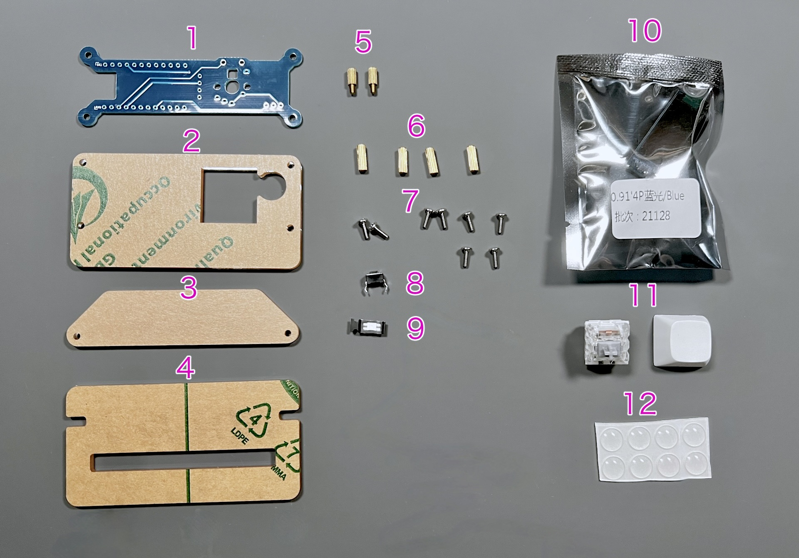
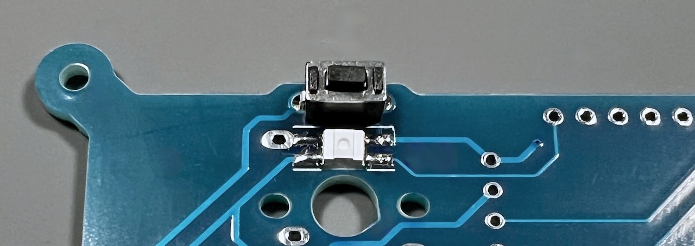
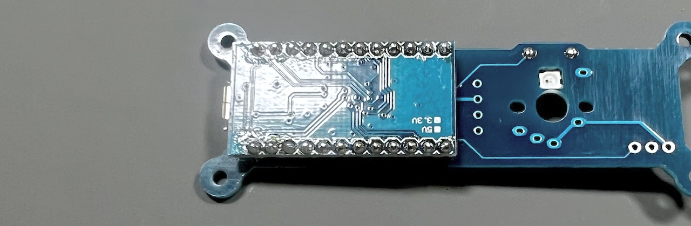
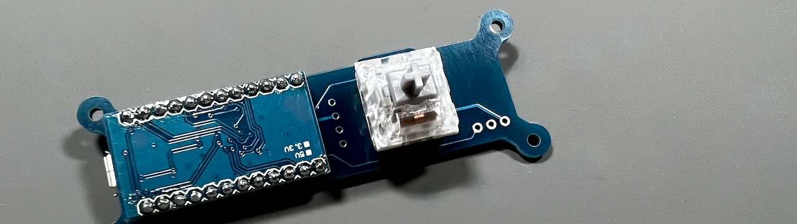
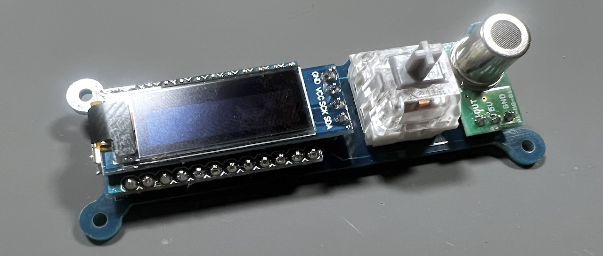
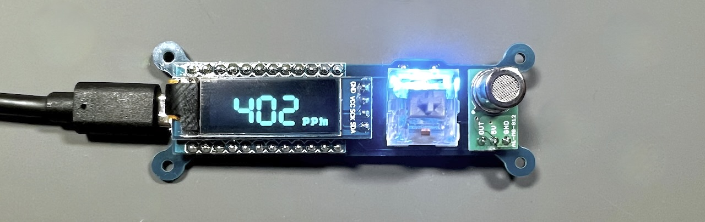
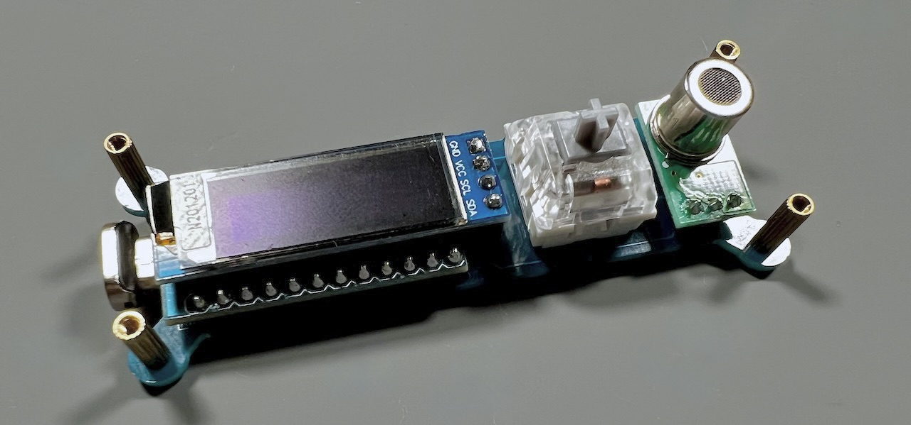
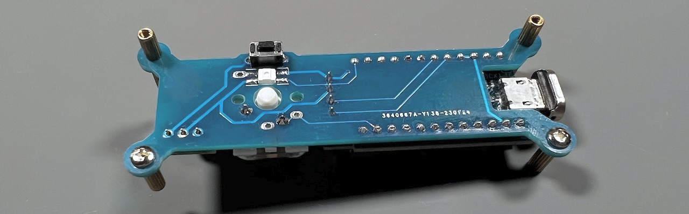
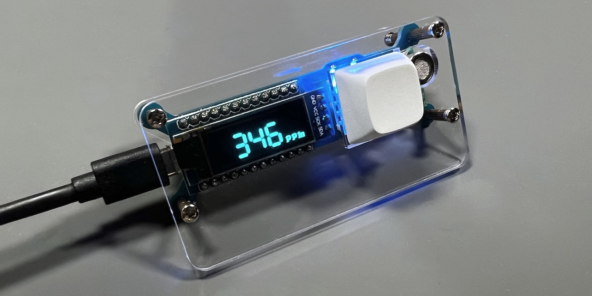

# CO2モニター自作キット
- [キット内容](#キット内容)
- [準備](#準備)
- [はんだ付け](#はんだ付け)
- [組み立て](#組み立て)
- [その他](#その他)

## ご注意
- CO2センサーは発熱します。触り続けると低温やけどを引き起こすのでご注意ください。
- 表示される数値は正確な濃度ではありません。換気された部屋を400ppmとした目安の値です。

## キット内容
 
||部品名|数||
|-|-|-|-|
|1|メインボード|1||
|2|トッププレート|1||
|3|ボトムプレート|1||
|4|スタンド|1||
|5|スペーサー（短）|4|M2 6mm|
|6|スペーサー（長）|2|M2 9mm|
|7|ねじ|6|M2 6mm|
|8|リセットスイッチ|1||
|9|LED|1|SK6812MINI-E|
|10|OLED|1||
|11|キースイッチ|1||
|12|キーキャップ|1||
|13|ゴム足|6||

### キット以外に必要なもの
|部品名|数||
|-|-|-|
|MG-812使用CO2ガスセンサアンプキット|1|[秋月電子通商](https://akizukidenshi.com/catalog/g/gK-16446/)|
|Pro Micro|1|[遊舎工房](https://shop.yushakobo.jp/products/pro-micro)、[TALP KEYBOARD](https://talpkeyboard.net/items/61f4604eacbcb036350954b6)|
|Micro-B USB ケーブル|1|各種キーボードショップ、100円均一など|

### オプション
|部品名||
|-|-|
|お好みのキースイッチ|CherryMX互換、Kailh choc v1、v2|
|お好みのキーキャップ||
|Type-C版Pro Micro||

### 必要な工具
|工具名|
|-|
|はんだごて|
|はんだ|
|精密ドライバー|
|ニッパー|
|エポシキ接着剤|

## はんだ付け
LEDをメインボード裏面にはんだ付けします。欠けがある方向と折れ曲がった白線が一致するようにしてください。
 
※個体差で白線が見えにくいものがあります。写真を参考にしてください。
 
リセットスイッチを裏面から差し込みはんだ付けします。
 
Pro Microを付属のピンヘッダーで取り付けて両面をはんだ付けします。
 
付属、もしくはお好みのキースイッチを表面に差し込みはんだ付けします。
 
MG-812使用CO2ガスセンサアンプキットを組み立てます。
 
OLEDはピンヘッダがはんだ付けされた状態でパッケージングされています。保護フィルムを剥がしてください。
 
OLEDとMG-812をメインボードにはんだ付けします。
 
動作の確認をするためにUSBケーブルでPCと接続しましょう。

### 動作テスト
こちらのファイルをダウンロードしてファームウェアを書き込んでください。
- [tarohayashi_co2monitor_default.hex](https://github.com/Taro-Hayashi/co2monitor/releases/download/0.19.12/tarohayashi_co2monitor_default.hex)

こちらのサイトにGoogle ChromeでアクセスするとWebブラウザ経由で書き込むことができます。
- https://sekigon-gonnoc.github.io/promicro-web-updater/index.html

Chromeを使わない場合はQMK Toolboxを使ってファームウェアを書き込んでください。
- [QMK Toolboxを使ったファームウェア更新方法](firmware.md)

ディスプレイに数字が表示され、キーを押すとLEDの発行方法が変わればはんだ付けに成功しています。
 

## 組み立て
USBケーブルを抜いてプレートを組付けます。  
メインボードにスペーサーを取り付けます。
 
表面の4箇所にスペーサー（短）を差し込み、裏面は写真のようにネジとスペーサー（長）で止めます。
 
トッププレートをねじ止めします。
 
ボトムプレートをねじで取り付けてゴム足を貼り付けたら完成です。
 
 
お好みでスタンドをお使いください。
 
### 使用方法
USBケーブルをPCやUSB充電器などに接続して好きなところに置いてください。  
起動した後に換気をすると正しい濃度に近い数値が表示されるようになります。

## その他
### ファームウェアのフォルダ  
https://github.com/Taro-Hayashi/qmk_firmware/tree/tarohayashi/keyboards/tarohayashi/co2monitor

### 販売サイト
- BOOTH: https://tarohayashi.booth.pm/items/4500742
